# **Sex and Cells**
### *An Informal Introduction to Biology*

---

## Primer
Welcome all! If somehow you've stumbled across the blog post, please note that this is ***not*** an authoritative guide to introductory biology. This document is a *study resource*, created by me (not a biologist) to prepare for a final exam taught by the wonderful [Dr. Claytor](https://www.linkedin.com/in/jordan-claytor-phd-619903b0/) at the University of North Carolina Chapel Hill. If you have any comments or suggestions, please reach out to my school [email](levlevi@email.unc.edu).

## I. Introduction
Biology is the **study of life**. It is an exploration of the structure and function of all living things. Life and Biology generally bear several similarities to the world of Computer Science. Upon closer inspection, life appears to work a lot like a computer. For living to function, they must break up complicated tasks into many well-defined sub-tasks. In the same way that your computer (the one you are reading this document on now) divides functionality into different components (e.g., CPU, RAM, etc), so to do living things employ a sort of compartmentalization. 

We divide Biology into **five major themes** to make it a little more palatable.

1. Evolution
2. Flow of Information: This includes the exchange of genetic material between organisms.
3. Structure and Function: Plainly, what do components of life look like and what do they do?
4. Transformation of Matter and Energy: Life is matter fueled by energy, as a result, the interactions between these two concepts become important.
5. Interactions Between Systems: Here we refer to biological systems big and small. These can be ecosystems or hormonal systems.

So we can say that life follows a kind of hierarchy. Living things and their components can be organized from small to big to stuff in a meaningful way. It is our goal in this exploration to develop a top-to-bottom understanding of the basics of biology. This isn't easy. Biology is a big field and spans a nearly endless number of topics. Therefore, as we work our way up the scales of life, we may be forced to take the occasional detour. This is necessary so that we don't leave out vital Biological processes that may be needed later.

We'll organize this document into four primary sections.

## Course Structure

1. Cells
2. Sex
3. Systems
4. Societies

Notice that we try our best to group concepts by relative scale. Before we jump into cells, however, it is necessary to provide a good definition of life. What makes a thing a "living thing" anyway? We say that a thing is "alive" if it meets a special set of criteria (or rules). There is no *official* set of rules for life, but generally, biologists agree that living things must be able to "respire, grow, excrete, reproduce, metabolize, move, and be responsive to the environment" [1]. This means that things like our friend the Amoeba are considered living, but viruses for example don't cut. As a result, any hunk of matter not conforming to these criteria is excluded from discussions of Biology.

## II. Cells

Cells are the smallest unit of life. Cells are both **alive** and **make up living things**. This means that big, complicated living things like yourself are made up of many tiny, smaller living things. Neat! But before we can dive into cells, we need to talk about the non-living stuff that makes up cells.

### A. Organic Molecules
**Organic molecules** are the building blocks of cells. We consider an organic molecule to be any chemical compound (a bunch of atoms bound together) in which a **carbon atom is bound to a hydrogen atom**. Small organic molecules are called **monomers**, and can combine into larger organic molecules called **polymers**. Together these molecules bind to provide the raw material of life.

One special type of organic molecule, the **amino acid**, acts as the building block for **proteins**. Proteins are a type of **macromolecule** (or *large* molecule), that perform an incredible variety of tasks in living things. We'll get back to proteins later. We say that all amino acids are composed of three basic components, an **amino group**, an **acidic carboxyl group**, and an **R-Group**. These are just the common chemical components of all amino acids. For example, if we looked at a diagram of any of the 20 amino acid variants, we would be able to spot all of these different parts. The R-Group is a little bit like the *thumbprint* of each amino acid. That is, each amino acid is primarily distinguishable by its unique R-Group.

Take a look at an abstracted amino acid in the figure below.

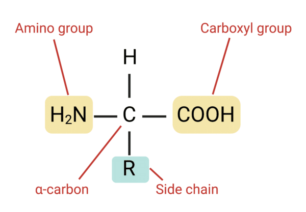

We also say that amino acids have four levels of *structure* organized by scale.

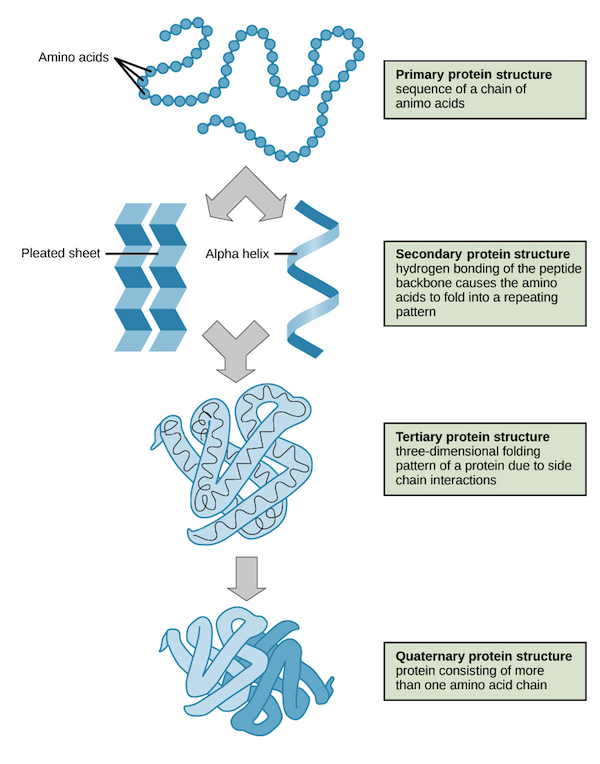

### B. Macromolecules
We'll now take a closer look at three important macromolecules (our next step up on the ladder of scale). Each macromolecule is made up of a unique monomer. **Proteins**, as mentioned earlier, are formed from long chains of amino acid monomers. **Carbohydrates**, or simple, starchy sugars, and comprised of the monomer **monosaccharides**. These monosaccharides can combine in a process called a **dehydration reaction**, and decouple via **hydrolosis**. The important thing to remember here is that dehydration ***combines***  molecules and hydrolysis ***breaks them apart***.

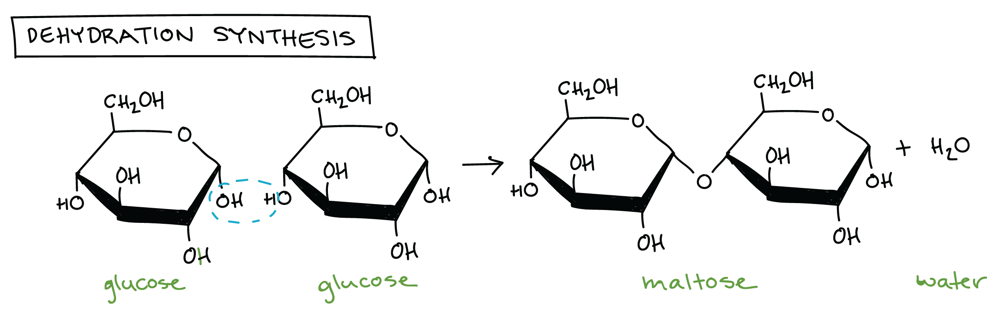

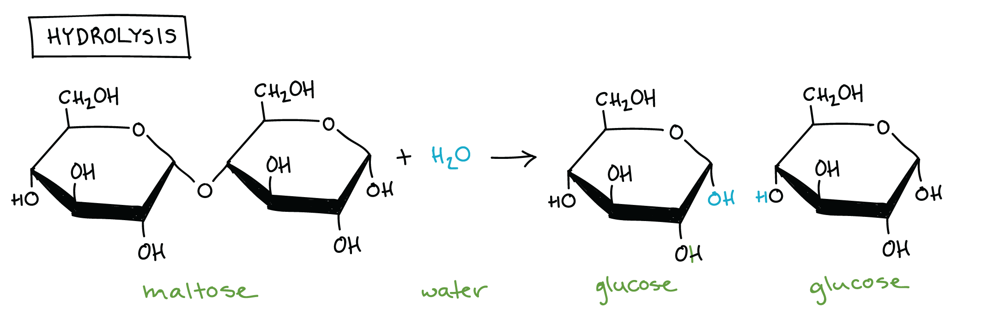

Any gym bros reading this might be able to guess what our last macromolecule is. That's right, **Fats**! Fats are **lipids**, another sub-class of organic molecules. that primarily store energy in organisms. Unlike our previous macromolecules, fats do **not** have a unique monomer. We say that fats are **hydrophobic** (water-fearing) because these repel water. This is probably intuitive to anyone who leaves a can of grease out to congeal overnight. In the morning you'll probably discover water left on top, and hardened fat left on bottom.

One other special kind of lipid is the **phospholipids**. These molecules are hydrophobic, and as a result, make up the outer membrane of cells. A double layer of these lipids keeps water *in* and *out* of the cell!

Briefly, we'll mention one more very special macromolecule: **DNA**. DNA is composed of **nucleotide** monomers and uses **hydrogen bonds** to hold together their double helix shape. We'll have plenty more to say about DNA a little later.

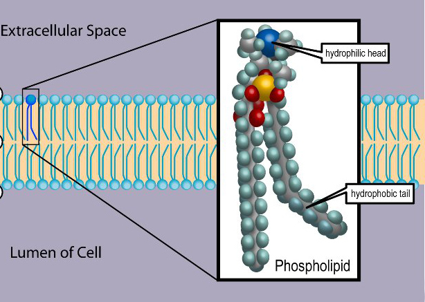

### C. The Cell Membrane

Now we get the barrier of the cell: the **cell membrane**. This vital structure controls the passage of materials in and out of the cell. We say the cell membrane has **selective permeability**, which is just a fancy way of saying it only lets some specific stuff in or out. Proteins embedded in the lipid layer of the membrane give it a **fluid mosaic** property. This means that the cell membrane is highly flexible and dynamic.

There are a few different ways that things can cross the cell membrane. One such mechanism is **passive transport** – the **diffusion** of substances across a membrane without energy. This process occurs when a substance moves from an area of *high* concentration to *low* concentration. A classic example of diffusion occurs when you leave a hot pan out on the stove to cool. Heat moves from the pan (an area of **high** energy concentration) to the surrounding air (**low** energy concentration).

The lipid-bilayer structure of the cell membrane keeps out **polar** and charged molecules. A polar molecule is simply any molecule that has opposite charges on either end. Water (H2O) is one such example of a polar molecule. Therefore, molecules like O2 and CO2 can easily cross the cell membrane, while polar molecules can not. Water can cross the cell membrane, however, through a process known as **osmosis**. It is crucial that cells maintain the *correct balance* of water, and so H2O can only cross the cell membrane in certain instances.

So when does water cross the cell membrane? The answer depends on the relative **tonicity** of the surrounding medium. Tonicity refers to the ability of a surrounding solution to cause a cell to gain or lose water. We say a cell is **isotonic** when tonicity is equal in and out of the cell. A cell is **hypertonic** when solute concentration is higher outside a cell, and **hypotonic** under the *opposite* conditions.

We stated earlier that diffusion can occur without *energy* because substances like to travel from areas of *high* to *low* concentration. But can molecules move the other way, from areas of *low* to *high* concentration? The answer is yes, albeit with a little help. **Facilitated diffusion** is the movement of substances from low to high concentration aided by **transport proteins**. These transport proteins provide the energy (e.g., **ATP**) required to overcome the friction caused by the diffusion gradient.

Cells can also inject or remove large particles by **endocytosis** and **exocytosis** respectively. 

### D. Cell Signaling
Cells are rarely acting alone. Most cells are part of larger, complex structures with functions that far exceed the capabilities of a single living thing. So, to achieve this superior functionality, cells must work together. Teamwork requires communication. 

The vast array of cells in the human body communicate by two primary mechanisms: **chemical** and **electrical signaling**. Chemical signals create slow, long-lasting responses in the body. These signals might include a prompt to the testes to create more testosterone or a series of signals that start an immune response. Electric signals, by contrast, are fast-acting and short-lasting. These signals target the muscles, neurons, and other rapid-fire structures in the body.

Hormone signals, as alluded to earlier, are *chemical* signals. These messages rely on **target cells**, or cells outfitted with **specific receptors** that allow them to respond to chemical messages produced from disparate parts of the body. **Hormone receptors** can appear on both the inside and outside of the cell membranes. These receptors are sites that allow hormone signals to bind to the cell.

These cells are a bit like the watchtower guards of the body. We'll break down the stages of hormone signaling into three parts, **reception**, **transduction**, and **response**. At a high level, we can think of each stage like this, respectively: "a message is received, a message is processed, and a response is sent."  

We can further divide hormone signaling into **water-soluble** and **lipid-soluble** hormones. In water-soluble hormone signaling, hormones are *polar* and thus are unable to cross the cell membrane. In lipid-soluble signaling, messages pass right through the exterior of the cell and into the **cytoplasm**. More details regarding these different processes are included in the figure below.

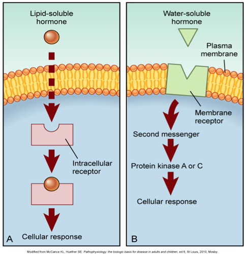

### E. Enzymes
We'll now briefly discuss **enzymes**, some of the unsung heroes of life on Earth. Cells require several chemical processes to perform their basic functions. These reactions occur quite slowly by default in nature. Even ordinary biological processes such as the conversion of starches into sugars could take thousands of years without intervention!

This is where enzymes come in. Enzymes are proteins that bind to the active sites of **substrates** (or **reactants**) in chemical reactions. By lowering the **activation energy** required for reactions to occur, enzymes *dramatically* increase reaction speed.

### F. Cellular Respiration
Now let's take a look at one of the most fundamental processes in all of nature, **cellular respiration**. But before we jump in, we need to brush up on a little chemistry. In chemical reactions, we say that an **oxidation** occurs when an atom *loses* an electron. By contrast, **reduction** occurs when an atom *gains* an electron. We can remember these terms with the useful nuemonic **OILRIG**. The processes always go hand and hand. Any time one atom loses an electron, another must *gain* an electron. Therefore, these processes are often referred to together as **redox** reactions. These terms will come in handy later when discussing the transfer of energy during chemical reactions in cells.

Now we are ready to talk about cellular respiration. Cellular respiration is the *primary* process by which cells make energy. Almost all organisms on Earth use some form of cellular respiration, even plants! We'll specifically examine a few different flavors of energy when talking about the *kinds* of energy organisms produce. Namely, we'll look at **chemical/potential** and **thermal/kinetic** energy. The commonality between these subclasses is that they all represent the same basic thing, the ability to do work.

Cellular respiration is essentially a conversion of chemical energy from nutrients into energy-poor **ATP**. Here, the reactants glucose and oxygen are transformed into carbon dioxide, water, and ATP. This process occurs on a higher level every time you take a breath! We can write the chemical equation for this process as such:

$$C_6H_{12}O_6 + 6O_2 \rightarrow 6CO_2 + 6H_2O + \text{energy}$$

This conversion is a multi-staged process where the energy produced during previous stages fuels subsequent processes. This movement of energy from one reaction to the next is known as **energy coupling**, where the reaction releasing energy is considered **exergonic** and the reaction receiving energy is **endergonic**. Cells fuel *endergonic* reactions by breaking down ATP stores, creating kinetic energy. 

Energy moves through the cell during respiration on "shuttles" called **cofactors**. These "exergy taxis" move electrons from reactants to product molecules. We'll see how cofactors come into play during ATP synthesis shortly. 

Let's walk through the three stages of cellular respiration in **eukaryotic** cells. Please note that the figures for ATP production are approximations. In a real-world scenario, the number of ATP molecules produced during a round of cellular respiration will vary. 

1. Stage One: **Glycloysis**
    - A glucose molecule is split into molecules of **pyruvic acid**.
    - Location: Cytoplasm
    - Inputs: `[NAD+, Glucose]`
    - Outputs: `[Pyruvate, 2-NADH, 2-ATP]`
2. Stage Two: The **Krebs Cycle** (A.K.A. The Citric Acid Cycle)
    - Pyruvate from the stage is broken down into carbon dioxide.
    - Location: **Mitochondrial Matrix**
    - Inputs: `[Acetyl-CoA (Converted from Pyruvate)*, NAD+, FAD]`
    - Outputs: `[NADH, FADH2, 2-ATP]`
3. Stage Three: **Oxidative Phosphorylation**
    - Location: **Inner Mitochondrial Membrane**
    - Inputs: `[NADH, FADH2, Oxygen]`
    - Outputs: `[Water, 28-ATP]`

`*` *Coenzyme A converts pyruvate into acetyl-CoA in between stages one and two.*

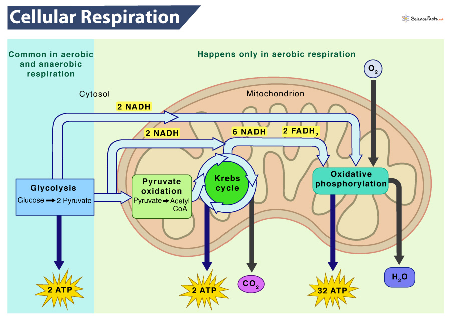

Oxidative phosphorylation is important enough to get it discussion. During the previous stages, the cofactors **NAD+** and **FAD** are reduced (receive electrons) to form **NADH** and **FADH2**, respectively. These cofactors are like cargo bays that can be filled with electrons to be dumped off somewhere else in the cell. During oxidative phosphorylation, our cofactors are *oxidized* to produce molecules of ATP. Hence the name, *oxidative* phosphorylation. 

This entire process of moving electrons within the mitochondria is facilitated by something called the **electron transport chains**. These structures are simply a collection of proteins and other molecules in mitochondria that enable redox reactions to occur. Ultimately, approximately *26 molecules* of ATP are created by **ATP synthase** from **ADP** and phosphate as electrons move down the electron transport chains. This process is referred to as **chemiosmosis** in the context of oxidative phosphorylation. The movement of **H+ ions** down the electron transport chains creates a **proton gradient**. ATP synthase allows H+ ions to move from areas of low to high concentration along this graduate. This release of energy fuels the conversion of ADP into ATP.

We also mention that **glycolysis** is responsible for producing an additional two molecules of ATP during the third stage of cellular respiration. The process oxidizes glucose into lactate (pyruvate) without the need for oxygen. This process is also referred to as **fermentation**. That burning sensation in your muscles that comes at the end of a hard workout can be explained by this phenomenon. Lactic acid is produced more rapidly than your body can remove it as cells attempt to create energy in an *anaerobic* environment.

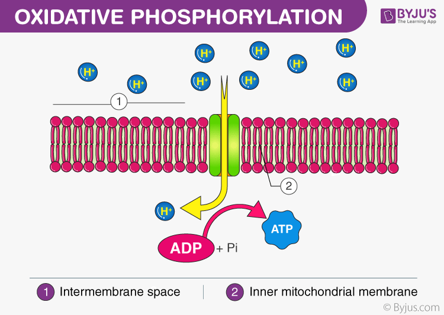

### G. Photosynthesis

Photosynthesis is a bit like the hippie cousin of cellular respiration. Similarly, photosynthesis is a *two-staged chemical reaction* that involves the production of energy-rich products from reactants. This process, as you may have guessed, occurs in plants. Specifically, photosynthesis occurs in the **chloroplasts** of plant cells where carbon dioxide and water convert into glucose and oxygen. Again, we can write a general equation for this reaction like so:

$$6CO_2 + 6H_2O + \text{light energy} \rightarrow C_6H_{12}O_6 + 6O_2$$

Photosynthesis broadly takes place within the **stroma** of chloroplasts. Here two sub-processes occur simultaneously: the **light-dependent reactions** and the **Calvin cycle**. 

*Light-dependent* reactions take place in the **thylakoid membranes** of chloroplasts. During this process, light energy from the sun helps split water molecules into oxygen, protons, and electrons. Oxygen is released as a by-product of this reaction, and high-energy electrons travel through the electron transport chain. Energy-carrying molecules ATP and NADPH produced during these reactions carry on to the Calvin Cycle.

**Photosystems I** and **II** are the components of the light-dependent reactions responsible for *absorbing energy from the sun*. Ironically, photosystem II is the first of these systems to come into play. This system is responsible for extracting oxygen molecules from water within the thylakoid membranes. Photosystem I has a slightly more niche role. Here electrons are 'boosted' or 'excited' so that NADP+ can reduce to NADPH. Below is a rather complicated diagram of these two systems at work. Try to understand their high-level differences.

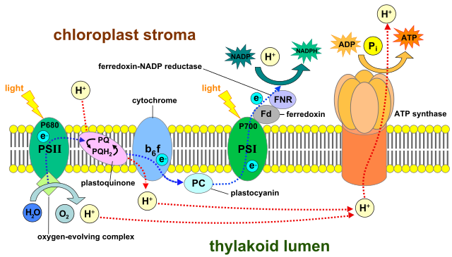

The Calvin Cycle, the last stage of photosynthesis, occurs in the fluid surrounding the thylakoids (**stroma**). ATP and NADPH provide the energy necessary to convert CO2 from the air into glucose ($C_6H_{12}O_6$). The carbon in this glucose molecule is stolen directly from the CO2 in the air via **carbon fixation**. In total, 18 ATP and 12 NADPH molecules are required to create *just one* molecule of glucose!

## III. Sex

So far, we've worked our way up the scales of life to the cellular level. We learned about the raw material making up cells and their chemical reactions, as well as a few fundamental cellular processes. But this is starting to get a bit drab. How can we make the leap from single cells to multi-cellular life?

Our second section is a broad exploration of reproduction and inheritance in nature. The title "Sex" is therefore a bit of a misnomer. We will employ a strong anthropocentric bias in the topics that follow. That is, we will specifically explore the ways that *humans* reproduce and pass on genes from generation to generation. Thankfully, many concepts such as reproduction are universal. Living things, in fact, **must** reproduce to be considered living. Therefore, even as our conversations skew towards human beings, the general concepts we learn will apply to many other living things.

There are two modes of reproduction. **Asexual reproduction** is the production of an exact genetic copy of an organism produced by a *single* living thing. This method is particularly popular among single-celled organisms. **Sexual reproduction**, by contrast, involves the production of new offspring by two organisms combining their unique genetic information. As human beings, we are primarily interested in the ladder method.

### A. Mitosis

All human beings begin life as single, fertilized cells. This microscopic organism contains all the genetic material to create a human being. The code for every organ, follicle of hair, synapse in your brain, and so on is packed into a near-invisible point in space and time. This code is written on strands of **DNA** densely woven into 23 pairs of **chromosomes** in human embryo cells. This cell will divide through a process called **mitosis** into daughter cells. Cell reproduction is a *recursive* process for those familiar with the term. 

Human cells embryonic cells are *eukaryotic* cells and pass through three phases of **interphase** preceding mitosis during cell division. These stages do not have a definite start or finish. Cell division is a continuous process happening all the time. During **G1 Phase** cells grow in size and prepare for DNA replication. Next, during **S Phase** (or "synthesis" phase) each chromosome duplicates to form two identical sets. Therefore, mitosis does **not** increase the genetic diversity of cells, and should be categorized as an *asexual* process. **G2** is the last stage preceding mitosis. During this step, the cell continues to grow and makes all final preparations before cell division.

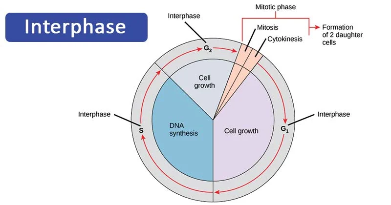

Mitosis contains many steps and sub-steps. For the sake of simplicity, we will overview only the most important stages of this process.

1. **Prophase**
    - Copies of chromosomes from interphase begin to condense and become visible. Our chromosomes now contain a pair of **sister chromatids**, which are joined together at a point called a **centromere**. Outside the nucleus, a structure called a **spindle** begins to form which is responsible for pulling chromosomes apart. 
2. **Prometaphase**
    - The **nuclear envelope** breaks down and the spindle fibers latch onto chromosomes. All the machinery is now in place to rip apart chromosomes.
3. **Metaphase**
    - Chromosomes line up down the middle of the cell. This step is very important. Our cell is going to divide along the equator in a little bit. Therefore, this "matching" procedure ensures that each new cell is getting an *exact* copy of each chromosome.
4. **Anaphase**
    - Finally, chromosomes are ripped apart and pulled towards opposite poles of the cell. We now have two copies of all the chromosomes aligned at the top and bottom cytoplasm.
5. **Telophase**
    - Two new nuclear envelopes begin to form around each respective pole of the cell.
6. **Cytokinesis**
    - Finally, the cell's cytoplasm splits into two complete daughter cells.

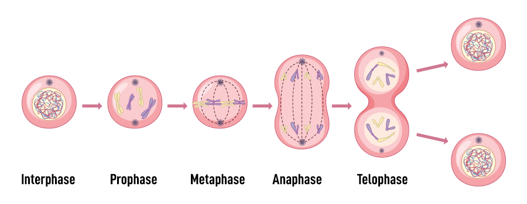

**Differentiation** is the process by which cells take on specialized roles following cell division. Cells in the human body perform a vast array of functions. Therefore, not every cell needs to divide continuously through the human life span. Some non-dividing cells such as nerve and muscle cells lack a "go-ahead" signal during the G1 phase of interphase. This exclusion prevents these cells from dividing by mitosis. As a result, the loss of nerve or muscle cells can be especially devastating in human beings.

Uncontrolled cell division may lead to the formation of a **tumor**. Typically, cells in the body divide as needed. However, as time goes on, structures responsible for managing cell division rates erode naturally. Sometimes these uncontrolled growths begin to spread to other parts of the body, hogging vital resources and interfering with basic bodily functions. Malignant tumors are also known as **cancer**.

### B. Meosis

We've now learned how a single, human embryonic cell can divide and differentiate into the collection of cells that make up a full-fledged human being. But we said that mitosis is an *asexual* reproductive process, don't human beings reproduce *sexually*? Admittedly, we skipped a step. **Meosis** is the process by which huamn sex cells (**gametes**) divide to help form **zygotes** after fertilization. 

Human sex cells (i.e., sperm and eggs) are considered **haploid** cells. The 'ha-' prefix here indicates that these cells contain *half* of the chromosomes required to create a complete genome. Zygotes (fertilized egg cells) are **diploid** cells, with "di-" meaning "two". Intuitively, these cells contain the full 46 chromosomes that program for a human being. Of our 46 total chromosomes, 44 are considered **autosomes**. The remaining two are **sex chromosomes**, and can code for females (**XX**) or males (**XY**).

Meiosis consists of two divisions, and unlike mitosis, *does* lead to an increase in genetic diversity. Meiosis consists of two identical rounds of cell division leading to the formation of 4 new sex cells. Once again, let's walk through the most important stages of meiosis.

1. **Prophase I**
    - Chromosomes line up within the cell to form pairs of **homologous chromosomes**. During this stage, chromosomes can swap genetic material in a process called **crossing over**.
2. **Metaphase I**
    - Similarly to mitosis, chromosomes line up in pairs at the equator of the cell. However, chromosomes now line up **randomly** via **independent assortment**. These independent arrangements of chromosomes promote an increase in genetic diversity.
3. **Anaphase I**
    - Pairs of chromosomes are pulled apart by the spindle fibers of the cell, while sister chromatids raim together.
4. **Telophase I and Cytokinesis**
    - The cell finally divides into two, with each new cell containing *half* the number of chromosomes as the original cell.

This process represents one more time during prophase II, metaphase II, anaphase II, and telophase II to create a total of 4 **haploid** cells.

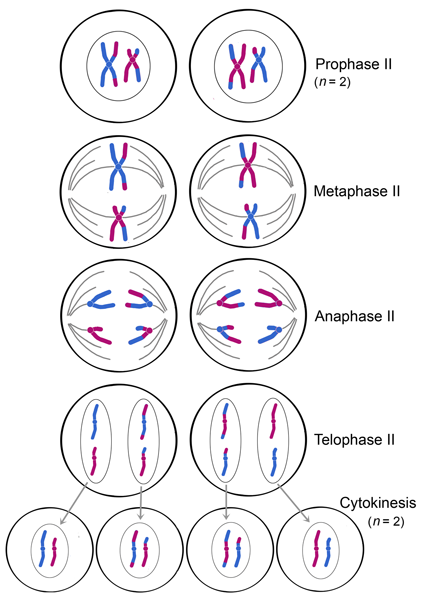

### C. DNA & RNA

Now we will talk about how genetic information is stored and read within the cell. What we are interested in here is a *flow of information*. That is, we wish to know what is communicated and how. Cells store genetic data on organic molecules and use this information as a kind of recipe to make other things with.

Let's talk about the hard drives of the cell: **DNA**. DNA (deoxyribonucleic acid) is the genetic code of life. This molecule is encoded using four unique states represented as **nucleotides** each composed of a sugar, a phosphate group, and a nitrogen base. These nucleotides come in four varieties, **adenine** (A), **thymine** (T), **cytosine** (C), and **guanine** (G). Nucleotides are held together by **phosphodiester** bonds, and bind together in a double helix shape held by weak hydrogen bonds.

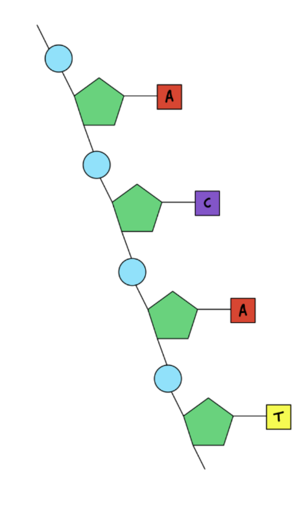
Through careful observation, scientists have discovered that A nucleotides always pair with T, and G pairs always pair with C. Variations in these simple base pairings account for the diversity of all living things on Earth. DNA sequences can even code for the structure and function of non-living things, such as viruses.

**RNA** is a complementary molecule to DNA involved in the translation and reproduction of DNA. RNA contains the A, C, and G, bases but swaps out thymine (T) for **uracil** (U). Whereas DNA acts as a genetic blueprint, RNA is responsible for carrying out the genetic instructions it encodes. We'll talk about two types of RNA, **mRNA** and **tRNA**. tRNA has two special sites. An anticodon site, where juxtaposing nucleotides are assembled from mRNA and an amino acid site.
 
Ultimately, DNA and RNA work together to create proteins throughout a multi-staged process. DNA is transcribed into RNA during a **transcription** phase. Transcription takes place in the nucleus of eukaryotic cells. An enzyme called **RNA polymerase** attaches to the **promoter** region of DNA. This marks the "head" of the sequence. Think of RNA polymerase like a translation device, mapping each nucleotide in a **template strand** to a corresponding RNA nucleotide. The enzyme works its way down the DNA until it comes to a terminator, a codon that marks the end of the strand The final output strand is called **RNA transcript**.

Next, messages carried by RNA are decoded in the **ribosomes** during the process of **translation** to make proteins. Let's take a look at this process in action.

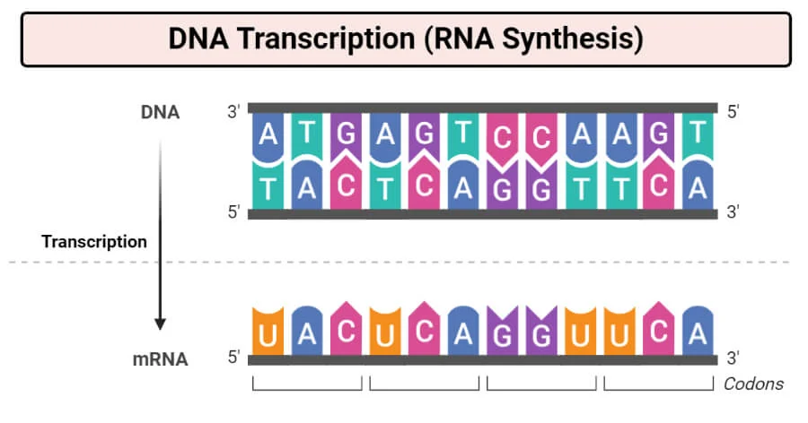

Specifically, sequences of base pairs are mapped to different amino acids. This is analogous to the process of encoding and decoding some piece of information on your computer. We define a group of three DNA or RNA nucleotides to be a **codon**. Each codon can code for a specific amino acid or stop sequence in the context of translation. The stop sequence simply marks the end of the translation process. There are three stop codons, **UAA**, **UAG**, and **UGA**, and one start codon, **AUG**.

Messenger RNA (mRNA) carries messages encoded in DNA through the cell. Translation RNA (tRNA) is responsible for fetching the right amino acids by matching **anticodons** to the codons of an mRNA strand. This process is shown in the diagram below.

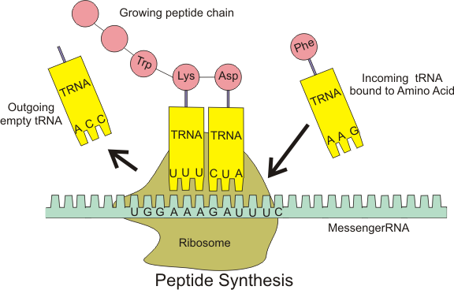

Let's sum up the two main processes by which genetic information passes through the cell. DNA acts as long-term storage that is read and copied by RNA polymerase into mRNA during transcription. Next, these mRNA strands then bind to ribosome molecules in the cytoplasm. Here, multiple "blocks" of tRNA coding for unique amino acids bind to the mRNA strand. The ribosome moves over the strand like a reader or `pointer`. All the while proteins are produced for every three nucleotides processed and are added to the back of the growing peptide chain similar to an `append` operation. The procedure of translation begins at a start codon and terminates at a stop codon. 

The final output of this entire process is a long complex polypeptide chain that folds up into a protein. This protein goes on to serve any number of functions throughout the body.

A summary of each stage of information transfer within a cell is provided below.

| Stage | Components | Location |
| --- | --- | --- |
| Transcription | DNA, RNA, mRNA, RNA Polymerase | Nucleus
| Translation | mRNA, tRNA, Ribosomes, Proteins, Amino Acids | Cytoplasm

### D. Mutations

All the time errors in transcription or translation lead to a corruption of genetic information. These errors typically occur as the result of exposure to a **mutagen**. A few different kinds of mutations can occur. A **missense** mutation involves the substitution of a single base in a DNA strand. This can result in a specific codon coding for different amino acids, or cause no visible change at all (**silent** mutation). A **nonsense** mutation occurs when a stop codon is introduced earlier in the DNA sequence, leading to a prematurely truncated protein. Lastly, a **frameshift** mutation involves offsetting an entire DNA sequence by a base pair. This last type of mutation is particularly devastating, as now *every single codon* might code for a new amino acid.

We must emphasize, however, that mutations are not inherently good *or* bad. Mutations are simply random perturbations to a genetic sequence that occur quite regularly. These random errors are a vital component of life. Over millions of years, Darwinian evolutionary theory argues that **natural selection** selects for the *fittest* mutations in a species. This phenomenon leads to evolution and eventually **speciation** (the creation of new species) over time. 

We'll work through a few examples of mutations in the diagram below.

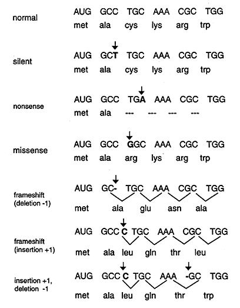

### E. Inheritance

Up to this point, our conservations remain at the cellular level. Now, we have the chance to work on the scale of *individuals*. As discussed previously, each organism carries with it a unique **genotype** (genome) that encodes its unique physical features (**phenotype**). We two mates reproduce via sexual reproduction, they produce an offspring with a mix of **traits**. When discussing inheritance, we seek to predict with what probability an offspring of two parents will have a certain set of characteristics. We will work in a highly idealized setting here. Often, predicting the specific traits an offspring will have is made incredible by the sheer number of genes in the human genome. Still, even in complex settings, the basic principles of inheritance continue to apply.

We will use a tool called a **punnet square** to enumerate all the possible combinations of gametes two parents can create for a given trait given their unique **alleles**. We write alleles as either capital or lowercase letters. Each parent carries exactly two alleles for any given trait. Therefore, if eye color is coded for by a single trait, we might say that someone with blue eyes carries the alleles "BB". The choice of letter here is arbitrary, so long as the letters are the same. 

When working with punnet squares make a few assumptions. For now, each parent carries exactly two alleles for a given trait. Secondly, capital-lettered alleles are **dominant** to lower-cases alleles. Let's go back to the eye color example. Consider four individuals with three unique sets of alleles for eye color. We'll say that the "dominant" phenotype is blue, and the "**recessive**" trait is brown for this trait. One thing we *don't* assume is that each allele from each parent is equally likely to be passed to the gamete. This phenomenon illustrates the **law of independent assortment**. 

| Alelles | Eye Color |
| :---: | :---: | 
| BB | Blue |
| Bb | Blue |
| bb | Brown |

Notice how even one large "B" is enough to dominate over the recessive "b". We'll say that individuals who carry two of the same "cased" alleles are **homozygous**, and those who carry dominant and recessive alleles for a trait are  **heterozygous**. Let's look at a complete punnett square representing a cross between two pea plants. Pea plants were the first organisms to be studied in such a way. Again, note how plants with just one large "G" are green in color.

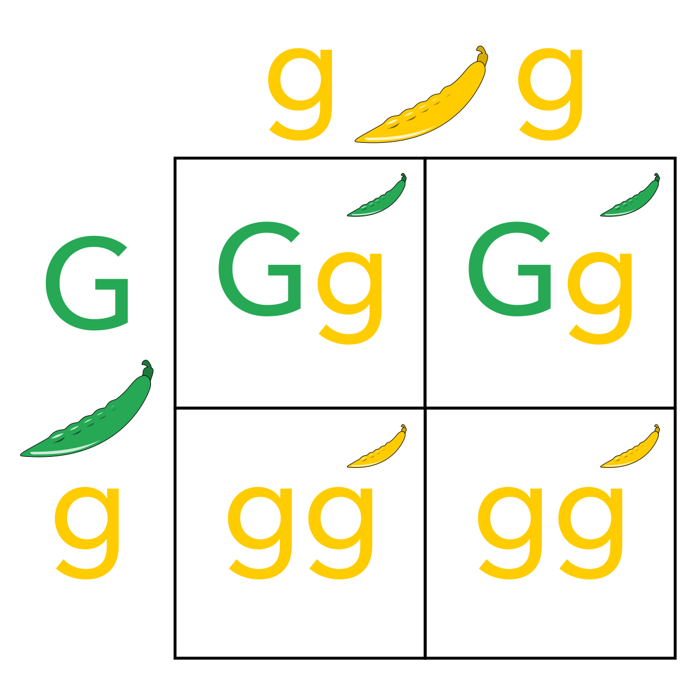

This experiment isolates the inheritance of one trait, and is referred to as a **monohybrid cross**. We can construct our punnet square to handle an infinite number of traits, however. Below is an example of **dihybrid-cross**, or cross isolating *two* traits. Note that our chart gets exponentially bigger. For this reason, we typically just look at one trait at a time using a Punnett square.

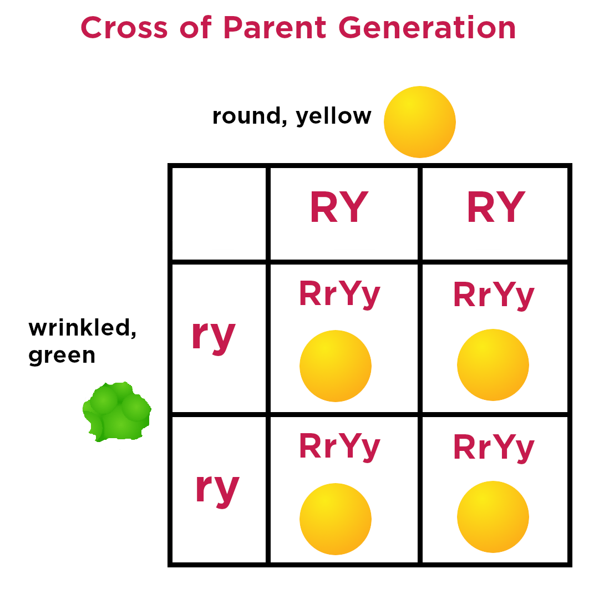

### F. Human Reproduction

Earlier we explored meiosis - the general method by which sex cells divide. Now we zoom back a bit to view the human reproductive process as a whole. Specifically, we are interested in how human reproductive organs facilitate sexual reproduction and genetic inheritance.
 
Human sex cells come in male (**sperm**) and female (**egg**) varieties. These cells each contain one-half the entire human genome in 23 chromosomes donated from each parent. For these cells to fuse into a zygote, fertilization must occur. Humans, unlike a few mammals, utilize **internal fertilization**, or fertilization within the body. But before fertilization can occur, sex cells must develop in the bodies of males and females. 

We start from the female perspective. Egg cells release from a **follicle** in the **ovary**. This follicle then becomes a **corpus lute**, which secretes hormones that aid in pregnancy. The egg is transported from the ovary to the **uterus** via the **oviduct**, where **normal implantation** may occur. **Oogenesis**, or the creation of new egg cells, starts at birth and ends after puberty.

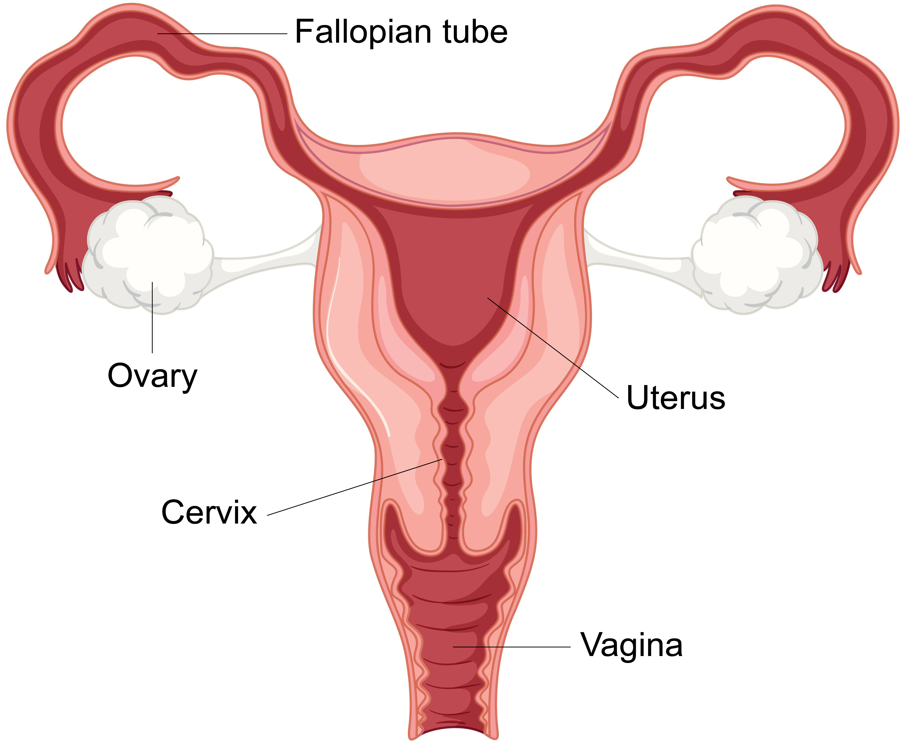

Now for the dudes. Sperm are the sex cells of males. Sperm development occurs in the **testes**, which are kept *outside* the body at a slightly lower temperature. New sperm form through **spermatogenesis** within the **seminiferous tubules**. On the journey towards the outside of the body, sperm travel through the testes, **epididymis**, **vas defers**, **ejaculatory duct**, and **urethra** sequentially. Several glands, including the **prostate** and **bulbourethral** glands further support **semen** production and ejaculation. 

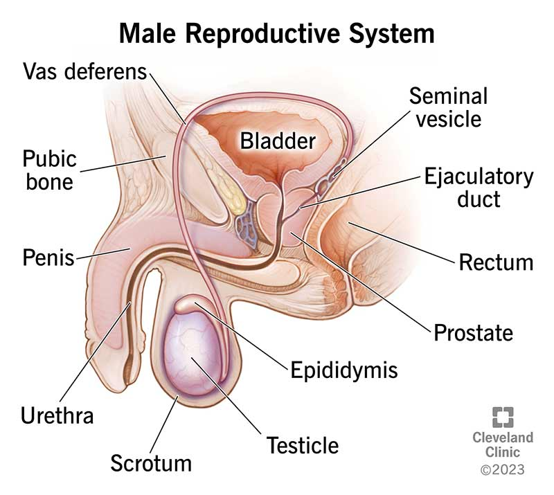

Production of semen is precipitated by the release of **LH** and **FSH** hormones by the **pituitary gland**. High **testosterone** lowers LH and FSH. The balance of hormonal signals in men and women keeps each respective system in **homeostasis** (balance). 

Approximately once a month, an egg is prepared for fertilization during **ovulation**, a stage in the **mental cycle** in females. Menstrual cycles are controlled by hormones, including regular dips and spikes of specific hormonal signals during different times of the month. The menstrual cycle is divided into four primary stages.

1. Menstrual Phase
    - The horomones **estrogen** and **progesterone** fall. Menstrual bleeding occurs as the old uterine lining (**endometrium**) is discarded.
2. Follicular Phase
    - An increase in FSH released by the pituitary gland leads to the production of new follicles, each containing an immature egg. 
3. Ovulation Phase
    - Rising estrogen levels correlate with a drop in LH. Next, ovulation occurs as the dominant follicle releases an egg from the ovary via ovulation.
4. Luteal Phase
    - The emptied follicle turns into a new structure called the **corpus luteum** responsible for producing progesterone and estrogen. The uterine lining is now at maximum thickness and is prepared for implantation. If the egg is not fertilized, the corpus luteum will degrade and disappear.

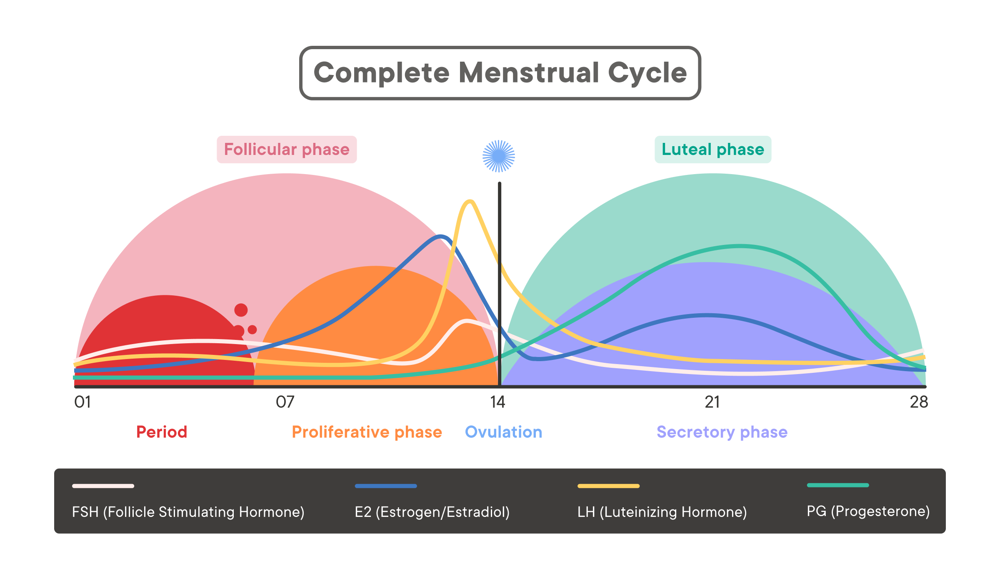
 
# IV. Systems

We now begin the first of two brief sections. **Systems** are a universal concept in biology. Simply, a system is any collection of functional apparatuses interacting within a common space. Life at all scales relies on systems to perform a plethora of functions. We have already explored a few of these structures. Energy production systems generate ATP at the level of cellular and human reproductive systems prompting the continuity of human life. We will examine one more system that lacks a clean fit within our previous sections.

### A. The Human Immune System

In living things, internal mechanisms work to maintain balance with an external environment. The human **immune system** ensures the proper function of bodily processes by responding to *external threats* through several sub-systems. Human beings have two primary mechanisms against disease-causing agents (**pathogens**). These responses include **innate immunity** and **passive immunity**. 

Innate immunity includes all the mechanisms humans acquire at birth. These defenses include skin, mucous membranes, stomach acid, **natural killer** cells, and more. Innate immunity is fast immunity and responds if not instantly, very quickly to foreign threats.

Acquired immunity occurs as humans gain exposure to new diseases over time. This form of immunity is slow. White blood cells or **lymphocytes**, are responsible for identifying and destroying foreign pathogens. **T cells** and **B cells** target **antigens**, or any substance that causes a bodily response. B cells specifically produce **antibodies**,  proteins that latch on to **antigens**. Upon detecting a foreign invader, B, and T cells proliferate through the body via **clonal selection**. Initial responses to a novel disease are typically slow. However, cellular "memory" allows the body to quickly fight the same disease in subsequent encounters. We say that **adaptive immunity** is **specific** and has **memory**.

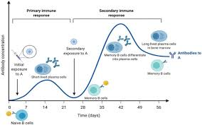

Adaptive immunity fights disease using via dual defense mechanism. This system employs **humoral** and **cell-mediated** immune responses. The humoral immune response involves the production of antibodies by B cells to fight extra-cellular pathogens. The cell-mediated response is carried out by T-cells that destroy infected cells by **apoptosis**. **Cytotoxic T cells** target cancer cells specifically.

# V. Societies

### A. Evolution of Populations

## VI. Bibliography
1. https://www.ncbi.nlm.nih.gov/pmc/articles/PMC10123176/. 
